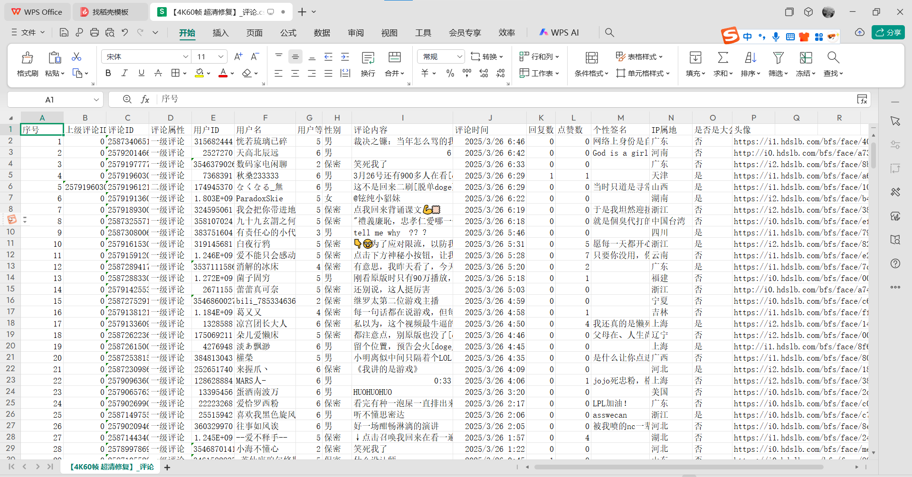
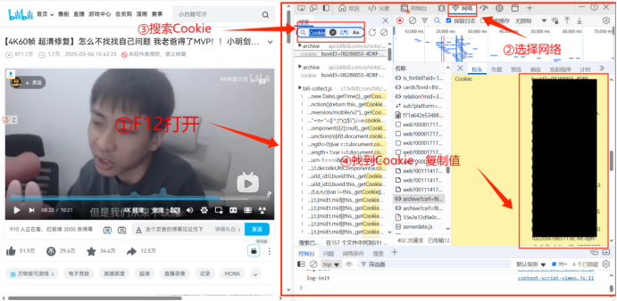
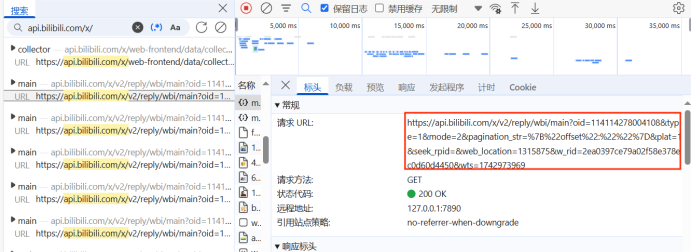
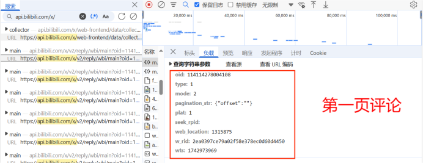
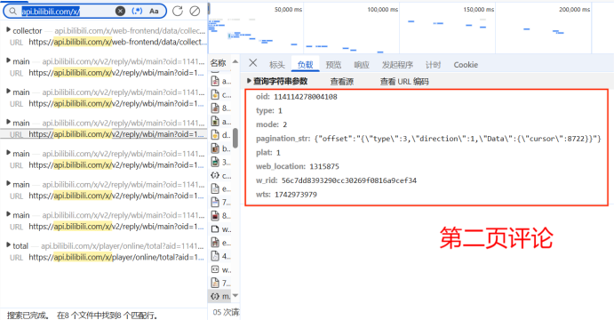
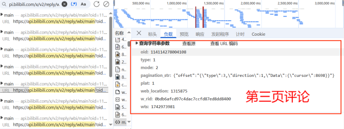
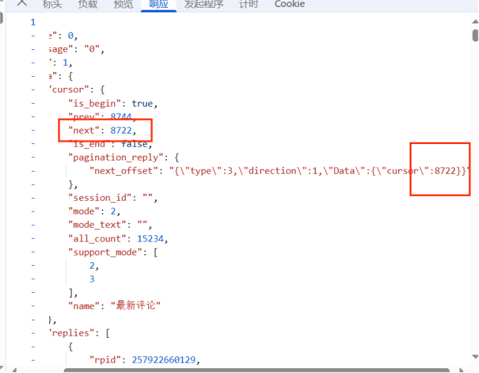
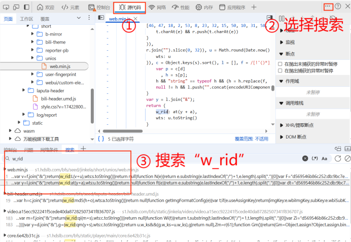

# 前言🐈
<font size=4 color=black>用于爬取Bilibili（B站）视频评论的爬虫，支持爬取一级评论及二级回复，并将数据导出为CSV文件。通过输入视频的BV号，脚本会自动获取视频信息并抓取相关评论，包含用户基本信息、评论内容、IP属地、头像、会员、等级等字段。🦄🦄

**🐨Github项目地址**：[bilibili-comment-crawler](https://github.com/1dyer/bilibili-comment-crawler)

**🐒CSDN项目地址**：[利用Request通过bv号爬取B站指定视频下所有评论（IP地址、大会员、等级、一二级评论等等)，附带源码和教程](https://blog.csdn.net/onedyer/article/details/146535940?spm=1011.2124.3001.6209)

**🐼博客教程地址**：[B站评论爬取(IP地址、内容、大会员、性别等等)教程 ](https://blog.ldyer.top/2025/03/26/B%E7%AB%99%E8%AF%84%E8%AE%BA%E7%88%AC%E5%8F%96/)

</font>

***

# 1. 数据样例🤪


***
# 2. 功能特性
- **​多级评论爬取**：支持爬取一级评论及二级回复。
- **​用户信息采集**：包括用户ID、用户名、等级、性别、IP属地、大会员状态等。
- **​自动分页处理**：自动遍历所有评论页，无需手动分页。
- **​反爬机制处理**：使用时间戳和MD5加密生成请求参数，降低被封禁风险。
- **​数据导出**：结果保存为CSV文件，兼容Excel和数据分析工具。
***
# 3. 快速开始
## 步骤1：配置Cookie
登录`B站`，然后按`F12`打开`开发者模式`,点击`网络`，在搜索框中搜索`Cookie`，就可以在下方的显示栏选中`Cookie`，在项目根目录创建`bili_cookie.txt`文件，将`Cookie`粘贴进去.



同理，搜索`User-Agent`,复制该值到代码中的Header里。
```python
# 获取B站的Header
def get_Header():
    with open('bili_cookie.txt','r') as f:
            cookie=f.read()
    header={
            "Cookie":cookie,
            "User-Agent":'这里是User-Agent值'
    }
    return header
```
## 步骤2：运行脚本

- 1.修改脚本中的目标视频BV号（代码末尾的 bv = `"BV1hMo4YrEW4"`）。
- 2.执行脚本
***
## 参数说明
​**is_second**​（默认开启）
设为True时爬取二级评论，False仅爬取一级评论。

**自定义请求头**
修改get_Header()中的User-Agent以模拟不同浏览器环境。
***

# 4. 核心原理
## 4.1 网络标头分析
通过抓包测试，B站网页端的评论获取是通过`请求URL`获取JSON格式的评论数据，在前端上解析出来。因此可以通过直接模拟网页截取JSON评论数据，来实现评论数据的爬取。



每一个`请求URL`大概有20条评论数据，因此需要不断访问全部的`请求URL`，来获得视频下面的所有评论。


观察`请求URL`中的链接参数，这些参数与负载有关，每个`请求URL`有不同的参数，通过这些不同的参数就可以访问不同的`请求URL`。





因此找到每一页的以下不同参数，就可以实现每一页的评论数据获取。
- `oid`
- `type`
- `mode`
- `pagination_str`
- `plat`
- `seek_rpid`
- `web_location`
- `w_rid`
- `wts`
***
## 4.2 oid的获取
不同视频都有其对应的`oid`值，通过函数获取该值，这样就能获得视频的`oid`和`标题`。

```python
# 通过bv号，获取视频的oid
def get_information(bv):
    resp = requests.get(f"https://www.bilibili.com/video/{bv}",headers=get_Header())
    # 提取视频oid
    obj = re.compile(f'"aid":(?P<id>.*?),"bvid":"{bv}"')
    oid = obj.search(resp.text).group('id')
    # 提取视频的标题
    obj = re.compile(r'<title data-vue-meta="true">(?P<title>.*?)</title>')
    title = obj.search(resp.text).group('title')
    return oid, title
```
***
## 4.3 type、plat、mode以及seek_rpid
`type`、`plat`和`mdoe`都是常量，分别为`1`、`1`和`2`。同时`seek_rpid`的值也默认为空
```python
    # 参数
    mode = 2
    plat = 1
    type = 1
    seek_rpid=''
```
## 4.4 web_location 
`web_location`的值也默认是`1315875`，如果不放心或者报错，则可以按照上述方法查看自己的`web_location`值
```python
web_location = 1315875
```
***
## 4.5 wts的获取
从名字就可以看出来`wts`是当下的时间戳，对于这个，可以调用`time`，获取现在的时间戳。
```python
    # 获取当下时间戳
    wts = time.time()
```
***
## 4.6 pagination_str 的提取
通过上图中的信息，可以发现`pagination_str`值在第一页时，默认值为`{"offset":""}`而后续页数都不同，其中从第二页，评论页的`\"cursor\"`值开始不同，为了寻找该值变化的规律，搜索不同数值，即`8722`的位置。




由此发现，所谓的`\"cursor\"`值都在上一页的JSON数据中。比如，获取了第一页，就可以获取第二页的`\"cursor\"`，以此访问第二页的数据，然后继续获得第三页的`\"cursor\"`，以此连接下去，最终获得所有页。
**通俗的解释就是，前一页蕴含着指向下一页的`“指针”`。** 代码大致如下：
```python
.....
    # 如果不是第一页
    if pageID != '':
        pagination_str = '{"offset":"{\\\"type\\\":3,\\\"direction\\\":1,\\\"Data\\\":{\\\"cursor\\\":%d}}"}' % pageID
    # 如果是第一页
    else:
        pagination_str = '{"offset":""}'

.....

# 下一页的pageID
    next_pageID = comment['data']['cursor']['next']
    # 判断是否是最后一页了
    if next_pageID == 0:
        print(f"评论爬取完成！总共爬取{count}条。")
        return
    # 如果不是最后一页，则停0.5s（避免反爬机制）
    else:
        time.sleep(0.5)
        print(f"当前爬取{count}条。")
        start(bv, oid, next_pageID, count, csv_writer,is_second)
```
## 4.7 w_rid与MD5加密算法
`w_rid`的获取最为复杂，首先需要获取它的位置



如图所示，它的结果来源于函数的计算，为了解出函数的具体功能以及函数中参数的内容，对这段代码进行断点测试。


断点后刷新页面，页面停止到该函数运行前


在控制台分别输入参数以及函数，观察输出结果


由此一切都解密出来了，`y`是几个上述参数以`&`拼接而来的字符串，而`a`是一个字符串常量，并且观察`at()`函数的运行结果，可以得出，它是一个MD5加密，返回`y`与`a`相加后的加密结果。
- `y`：其他变量通过`&`相互拼接形成的字符串
- `a`：加密参数，默认为`'ea1db124af3c7062474693fa704f4ff8'`
- `at()`：MD5加密算法，加密`y`与`a`

`w_rid`的加密过程如下
```python
    # MD5加密
    md5_str='ea1db124af3c7062474693fa704f4ff8' # 加密参数
    code = f"mode={mode}&oid={oid}&pagination_str={urllib.parse.quote(pagination_str)}&plat={plat}&seek_rpid={seek_rpid}&type={type}&web_location={web_location}&wts={wts}" + md5_str
    MD5 = hashlib.md5()
    MD5.update(code.encode('utf-8'))
    w_rid = MD5.hexdigest()
```
# 5.关于爬取番剧评论
由于某些番剧或者视频没有直接显示BV号，因此可以参考[[小技巧]如何查看番剧的av号](https://www.bilibili.com/opus/170361423985061672)，来获取你要爬取番剧的BV号

# 6. 完整代码
```python
import re
import requests
import json
from urllib.parse import quote
import pandas as pd
import hashlib
import urllib
import time
import csv

# 获取B站的Header
def get_Header():
    with open('bili_cookie.txt','r') as f:
            cookie=f.read()
    header={
            "Cookie":cookie,
            "User-Agent":'Mozilla/5.0 (Windows NT 10.0; Win64; x64) AppleWebKit/537.36 (KHTML, like Gecko) Chrome/134.0.0.0 Safari/537.36 Edg/134.0.0.0'
    }
    return header


# 通过bv号，获取视频的oid
def get_information(bv):
    resp = requests.get(f"https://www.bilibili.com/video/{bv}",headers=get_Header())
    # 提取视频oid
    obj = re.compile(f'"aid":(?P<id>.*?),"bvid":"{bv}"')
    oid = obj.search(resp.text).group('id')
    # 提取视频的标题
    obj = re.compile(r'<title data-vue-meta="true">(?P<title>.*?)</title>')
    try:
        title = obj.search(resp.text).group('title')
    except:
        title = "未识别"
    return oid, title

# 轮页爬取
def start(bv, oid, pageID, count, csv_writer, is_second):
    # 参数
    mode = 2
    plat = 1
    type = 1
    seek_rpid=''
    web_location = 1315875

    # 获取当下时间戳
    wts = time.time()

    # 如果不是第一页
    if pageID != '':
        pagination_str = '{"offset":"{\\\"type\\\":3,\\\"direction\\\":1,\\\"Data\\\":{\\\"cursor\\\":%d}}"}' % pageID
    # 如果是第一页
    else:
        pagination_str = '{"offset":""}'

    # MD5加密
    md5_str='ea1db124af3c7062474693fa704f4ff8' # 加密参数
    code = f"mode={mode}&oid={oid}&pagination_str={urllib.parse.quote(pagination_str)}&plat={plat}&seek_rpid={seek_rpid}&type={type}&web_location={web_location}&wts={wts}" + md5_str
    MD5 = hashlib.md5()
    MD5.update(code.encode('utf-8'))
    w_rid = MD5.hexdigest()

    url = f"https://api.bilibili.com/x/v2/reply/wbi/main?oid={oid}&type={type}&mode={mode}&pagination_str={urllib.parse.quote(pagination_str, safe=':')}&plat=1&seek_rpid={seek_rpid}&web_location={web_location}&w_rid={w_rid}&wts={wts}"
    comment = requests.get(url=url, headers=get_Header()).content.decode('utf-8')
    comment = json.loads(comment)

    for reply in comment['data']['replies']:
        # 评论数量+1
        count += 1
        # 上级评论ID
        parent=reply["parent"]
        # 评论ID
        rpid = reply["rpid"]
        # 用户ID
        uid = reply["mid"]
        # 用户名
        name = reply["member"]["uname"]
        # 用户等级
        level = reply["member"]["level_info"]["current_level"]
        # 性别
        sex = reply["member"]["sex"]
        # 头像
        avatar = reply["member"]["avatar"]
        # 是否是大会员
        if reply["member"]["vip"]["vipStatus"] == 0:
            vip = "否"
        else:
            vip = "是"
        # IP属地
        try:
            IP = reply["reply_control"]['location'][5:]
        except:
            IP = "未知"
        # 内容
        context = reply["content"]["message"]
        # 评论时间
        reply_time = pd.to_datetime(reply["ctime"], unit='s')
        # 相关回复数
        try:
            rereply = reply["reply_control"]["sub_reply_entry_text"]
            rereply = int(re.findall(r'\d+', rereply)[0])
        except:
            rereply = 0
        # 点赞数
        like = reply['like']

        # 个性签名
        try:
            sign = reply['member']['sign']
        except:
            sign = ''

        # 写入CSV文件
        csv_writer.writerow([count, parent, rpid, "一级评论",uid, name, level, sex, context, reply_time, rereply, like, sign, IP, vip, avatar])

        # 二级评论(如果开启了二级评论爬取，且该评论回复数不为0，则爬取该评论的二级评论)
        if is_second and rereply !=0:
            for page in range(1,rereply//10+2):
                second_url=f"https://api.bilibili.com/x/v2/reply/reply?oid={oid}&type=1&root={rpid}&ps=10&pn={page}&web_location=333.788"
                second_comment=requests.get(url=second_url,headers=get_Header()).content.decode('utf-8')
                second_comment=json.loads(second_comment)
                for second in second_comment['data']['replies']:
                    # 评论数量+1
                    count += 1
                    # 上级评论ID
                    parent=second["parent"]
                    # 评论ID
                    second_rpid = second["rpid"]
                    # 用户ID
                    uid = second["mid"]
                    # 用户名
                    name = second["member"]["uname"]
                    # 用户等级
                    level = second["member"]["level_info"]["current_level"]
                    # 性别
                    sex = second["member"]["sex"]
                    # 头像
                    avatar = second["member"]["avatar"]
                    # 是否是大会员
                    if second["member"]["vip"]["vipStatus"] == 0:
                        vip = "否"
                    else:
                        vip = "是"
                    # IP属地
                    try:
                        IP = second["reply_control"]['location'][5:]
                    except:
                        IP = "未知"
                    # 内容
                    context = second["content"]["message"]
                    # 评论时间
                    reply_time = pd.to_datetime(second["ctime"], unit='s')
                    # 相关回复数
                    try:
                        rereply = second["reply_control"]["sub_reply_entry_text"]
                        rereply = re.findall(r'\d+', rereply)[0]
                    except:
                        rereply = 0
                    # 点赞数
                    like = second['like']
                    # 个性签名
                    try:
                        sign = second['member']['sign']
                    except:
                        sign = ''

                    # 写入CSV文件
                    csv_writer.writerow([count, parent, second_rpid, "二级评论", uid, name, level, sex, context, reply_time, rereply, like, sign, IP, vip, avatar])

    # 下一页的pageID
    next_pageID = comment['data']['cursor']['next']
    # 判断是否是最后一页了
    if next_pageID == 0:
        print(f"评论爬取完成！总共爬取{count}条。")
        return
    # 如果不是最后一页，则停0.5s（避免反爬机制）
    else:
        time.sleep(0.5)
        print(f"当前爬取{count}条。")
        start(bv, oid, next_pageID, count, csv_writer,is_second)

if __name__ == "__main__":
    # 获取视频bv,输入指定视频的bv，就可以爬取该视频下所有数据
    bv = "BV1zWA8eSEBw"
    # 获取视频oid和标题
    oid,title = get_information(bv)
    # 评论起始页（默认为空）
    next_pageID = ''
    # 初始化评论数量
    count = 0


    # 是否开启二级评论爬取，默认开启
    is_second = True


    # 创建CSV文件并写入表头
    with open(f'{title[:12]}_评论.csv', mode='w', newline='', encoding='utf-8-sig') as file:
        csv_writer = csv.writer(file)
        csv_writer.writerow(['序号', '上级评论ID','评论ID', "评论属性",'用户ID', '用户名', '用户等级', '性别', '评论内容', '评论时间', '回复数', '点赞数', '个性签名', 'IP属地', '是否是大会员', '头像'])

        # 开始爬取
        start(bv, oid, next_pageID, count, csv_writer,is_second)
```
